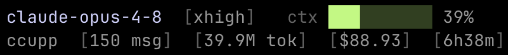

# claude-code-usage-per-project (ccupp)

A Claude Code status line and usage tracker that shows per-project efficiency metrics — messages, tokens, cost, and API time — across all sessions for the current working directory.

```bash
pip install ccupp && ccupp install
```

(Requirements: Python 3.6+)

## What it does

### 1. Status line (piped from Claude Code)



- **Line 1**: Model name — effort level — context-window bar (green/yellow/red at 70%/90%)
- **Line 2**: Project name — `[N msg]` user messages sent — `[Nk tok]` tokens used — `[$N.NN]` cost — `[XhYm]` total API response time (all cumulative for the session)

### 2. Usage report (run directly in terminal)

```
$ ccupp
```

Prints a boxed per-session table for the project in the current directory:

```
myproject — Claude Code usage (per project)

╭──────────────┬─────────────────┬──────────┬────────┬───────┬─────────╮
│ SESSION      │ DATE            │ USER_MSG │ TOKENS │  COST │    TIME │
├──────────────┼─────────────────┼──────────┼────────┼───────┼─────────┤
│ 9beb422a     │ 2026-05-30 12:00│       12 │  84.2k │ $1.83 │  6m12s  │
│ 0ec212f4~    │ 2026-05-29 09:15│        8 │  51.0k │ $0.94 │  4m30s  │
├──────────────┼─────────────────┼──────────┼────────┼───────┼─────────┤
│ TOTAL        │                 │       20 │ 135.2k │ $2.77 │ 10m42s  │
╰──────────────┴─────────────────┴──────────┴────────┴───────┴─────────╯
  ~ = backfill estimate (cost·time approximate)
```

### 3. Daily breakdown (run directly in terminal)

```
$ ccupp --daily
```

Same current-project scope as the usage report, but grouped by local calendar day instead of by session — recomputed from the raw transcripts so each request's tokens, cost, and time land on the day it happened:

```
myproject — Claude Code usage by day

╭────────────┬──────────┬────────┬───────┬─────────╮
│ DATE       │ USER_MSG │ TOKENS │  COST │    TIME │
├────────────┼──────────┼────────┼───────┼─────────┤
│ 2026-05-29 │        8 │  51.0k │ $0.94 │  4m30s  │
│ 2026-05-30 │       12 │  84.2k │ $1.83 │  6m12s  │
├────────────┼──────────┼────────┼───────┼─────────┤
│ TOTAL      │       20 │ 135.2k │ $2.77 │ 10m42s  │
╰────────────┴──────────┴────────┴───────┴─────────╯
```

### 4. Model breakdown (run directly in terminal)

```
$ ccupp --model
```

The current project's usage split per model, sorted by cost (highest first) — useful for seeing where spend concentrates between Opus, Sonnet, and Haiku:

```
myproject — Claude Code usage by model

╭───────────────────┬──────┬────────┬───────╮
│ MODEL             │ REQS │ TOKENS │  COST │
├───────────────────┼──────┼────────┼───────┤
│ claude-opus-4-7   │   38 │  96.1k │ $2.41 │
│ claude-sonnet-4-6 │   21 │  39.1k │ $0.36 │
├───────────────────┼──────┼────────┼───────┤
│ TOTAL             │   59 │ 135.2k │ $2.77 │
╰───────────────────┴──────┴────────┴───────╯
```

### 5. All-projects comparison (run directly in terminal)

```
$ ccupp --all
```

Prints a boxed comparison table with one row per project across every project ccupp has tracked, sorted by cost (highest first). Projects spread across renamed folders are merged into a single row via their git identity:

```
Claude Code usage — all projects

╭───────────┬──────────┬──────────┬────────┬─────────┬───────╮
│ PROJECT   │ SESSIONS │ USER_MSG │ TOKENS │    COST │  TIME │
├───────────┼──────────┼──────────┼────────┼─────────┼───────┤
│ myproject │       20 │      548 │ 101.7M │  $59.97 │ 2h58m │
│ ccupp     │        4 │      109 │ 148.1M │  $48.46 │ 4h15m │
│ blog      │       13 │      123 │  66.2M │  $24.36 │ 1h29m │
├───────────┼──────────┼──────────┼────────┼─────────┼───────┤
│ TOTAL     │       37 │      780 │ 316.0M │ $132.79 │ 8h42m │
╰───────────┴──────────┴──────────┴────────┴─────────┴───────╯
```

### 6. Prompt export (run directly in terminal)

```
$ ccupp --export
```

Exports every human prompt you typed (filtering out tool results, system messages, UI slash commands like `/usage` or `/model`, interrupt markers) to `PROMPTS.md` as a chronological Markdown document.

```
✅ ./PROMPTS.md
   3 sessions · 47 prompts
```

```markdown
# myproject — Prompts

Generated 2026-05-30 12:00 · 2 sessions · 3 prompts

## Session 1 · 2026-05-29 09:15 · `0ec212f4`

2 prompts

**1.**

> refactor the auth module to use JWT

**2.**

> add unit tests for the new token validation logic

---

## Session 2 · 2026-05-30 12:00 · `9beb422a`

1 prompt

**1.**

> how does the session snapshot work?
```

### 7. Help and version (run directly in terminal)

```
$ ccupp --help      # or -h
$ ccupp --version   # or -v
```

`--help` lists every mode (the bare `ccupp` default report, `--daily`, `--model`, `--all`, `--export`, and `install`). `--version` prints the installed version:

```
$ ccupp --version
ccupp 0.2.2
```

## How it works

### Cumulative totals and project identity

Each session writes a snapshot file to `.ccupp/sessions/<session_id>.json` inside the Claude transcript directory. The current session's snapshot is overwritten on every render (idempotent). Past sessions without a snapshot are backfill-estimated from the raw `.jsonl` transcript — these are marked with `~` in the report, and their cost and time are approximate.

A backfill snapshot is a cache, not a write-once file: it records the byte size of the transcript it was computed from (`src_size`), and is recomputed whenever the transcript grows past that size. This keeps backfill totals consistent with the `--daily`/`--model` recompute even if a session's snapshot was first written mid-session. Live snapshots (exact cost/time from Claude Code's stdin) are never invalidated.

To accumulate totals across sessions, ccupp resolves a stable project identity from git:

1. **Remote URL** — normalized and SHA-1 hashed (`remote:<hash>`)
2. **First commit SHA** — used when there's no remote (`commit:<sha>`)
3. **Current directory only** — fallback when there's no git history

The identity → list of transcript directories mapping is stored in `~/.ccupp/registry.json`. This means totals are preserved across folder renames as long as the git identity is stable.

### How each metric is calculated

Modeled on [ccusage](https://github.com/ryoppippi/ccusage)'s approach:

- **Messages** — user-type entries, excluding tool results, meta/sidechain messages, and short UI commands (e.g. `/usage`, `/model`)
- **Tokens** — sum of `input`, `cache_creation_input`, `cache_read_input`, and `output` tokens across deduplicated assistant messages. Deduplication is by `(message.id, requestId)`; when keys collide, non-sidechain wins, then larger token total wins.
- **Cost** — live sessions use `total_cost_usd` from Claude Code's stdin directly. Backfill uses ccusage Auto mode: `costUSD` field per entry if present, otherwise computed from tokens × per-model rates from [LiteLLM's pricing file](https://github.com/BerriAI/litellm), cached at `~/.ccupp/litellm-pricing.json` for 24h.
- **Time** — live sessions use `total_api_ms` from stdin. Backfill estimates by measuring the gap between each user message timestamp and the last assistant message timestamp for the same `requestId`.

The per-session report and all-projects comparison read these cached snapshots. The `--daily` and `--model` breakdowns instead recompute from the raw transcripts every time (snapshots only carry session totals, not per-day or per-model splits), reusing the same deduplication and Auto-mode cost model — so their totals reconcile with the per-session report. Dates in `--daily` are bucketed by your local timezone, matching the report's local-time dates.

## License

MIT — see [LICENSE](LICENSE).
